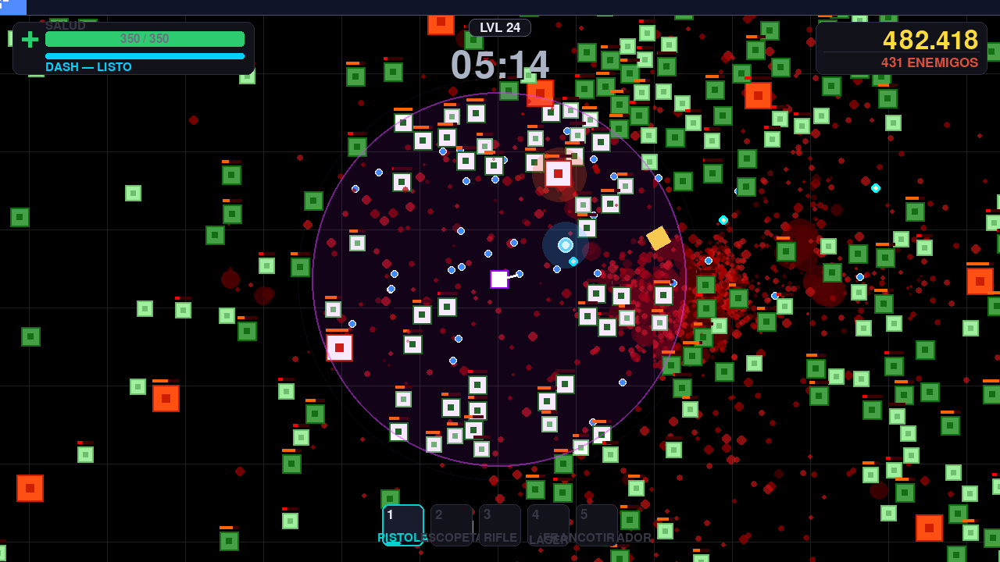
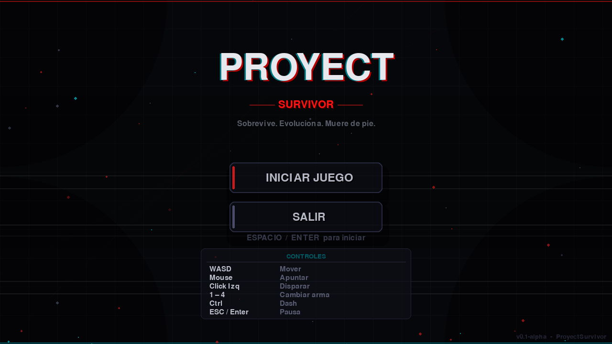
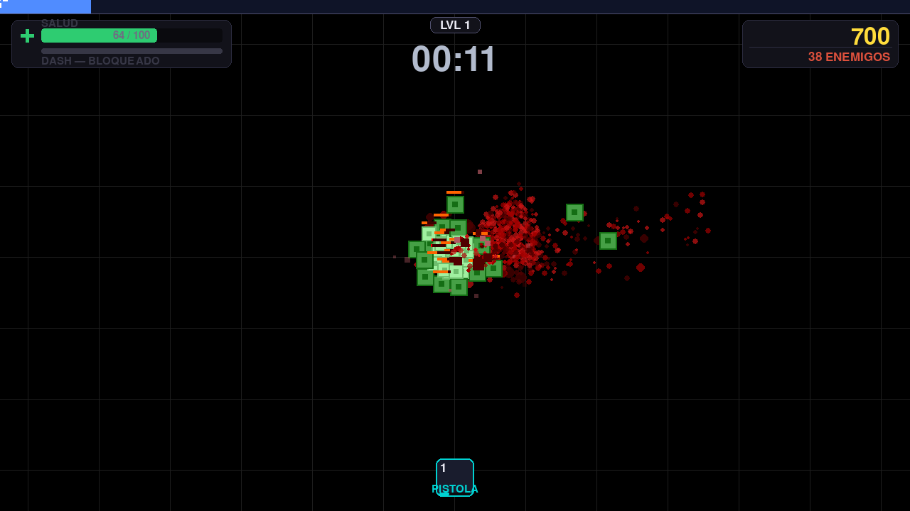
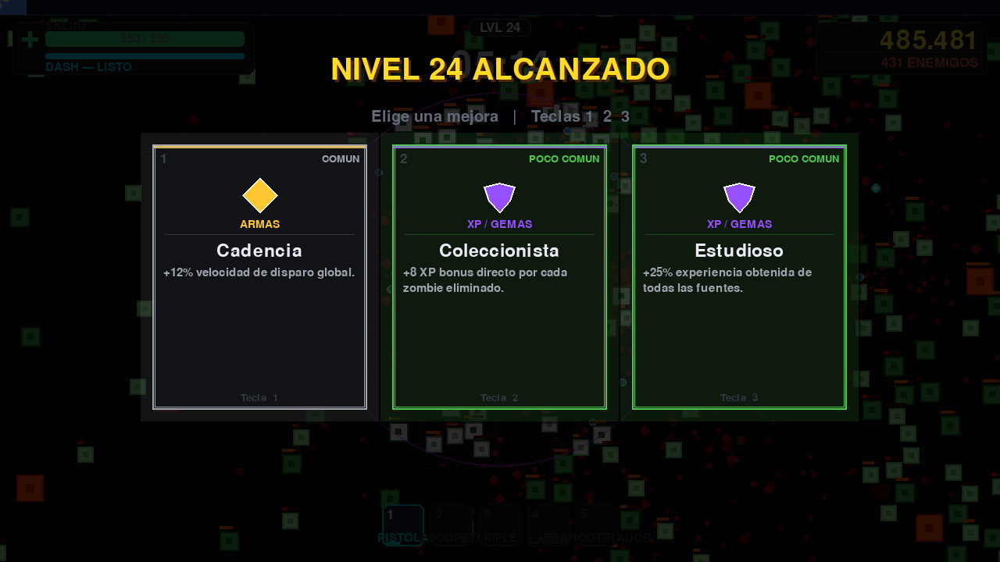
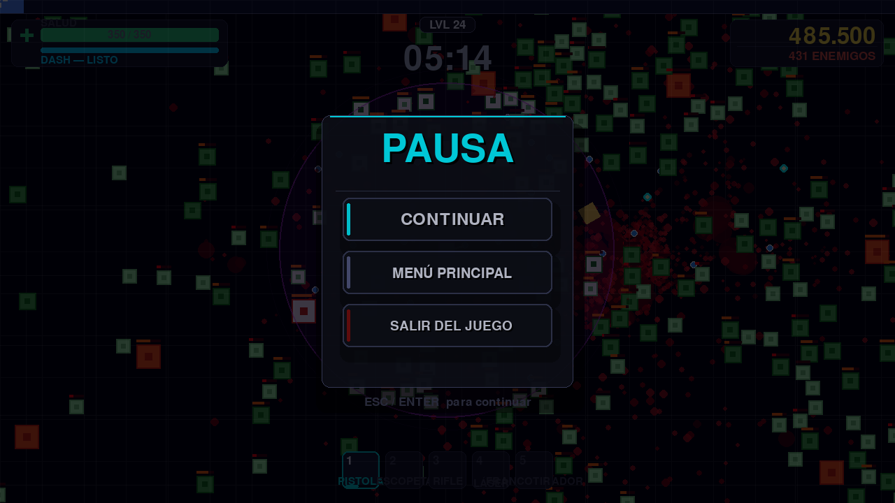
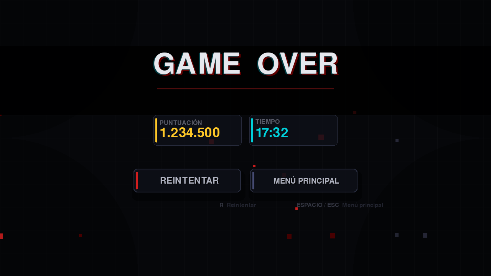

# ProyectSurvivor

**Survival roguelite de acción en 2D inspirado en *Vampire Survivors*, escrito en Python con pygame.**

Muévete, dispara y aguanta: las hordas crecen con el tiempo, cada enemigo caído suelta experiencia y cada subida de nivel abre tres mejoras entre más de cuarenta. Sobrevive un minuto más, siempre un minuto más.

> [!NOTE]
> El proyecto está en desarrollo (**v0.1-alpha**). El balance se ajusta con frecuencia y puede cambiar entre versiones.



## Índice

- [Características](#características)
- [Capturas](#capturas)
- [Requisitos](#requisitos)
- [Instalación](#instalación)
- [Controles](#controles)
- [Mecánicas](#mecánicas)
- [Estructura del proyecto](#estructura-del-proyecto)
- [Rendimiento](#rendimiento)
- [Desarrollo](#desarrollo)
- [Solución de problemas](#solución-de-problemas)

## Características

- **Acción en tiempo real**: movimiento con WASD/flechas, apuntado con el ratón y disparo continuo manteniendo el click izquierdo.
- **8 armas**: 5 activas desbloqueables (pistola, escopeta, rifle de asalto, láser y francotirador) y 3 pasivas que funcionan solas (nova de espinas, orbes orbitales y boomerang arcano).
- **42 mejoras** en 5 rarezas, repartidas en cuatro categorías: movimiento, supervivencia, armas y XP.
- **6 tipos de enemigos**, incluidos explosivos y atacantes a distancia, en hordas de hasta **900 simultáneos**.
- **Progresión por experiencia**: gema por enemigo, imán de recogida, fusión de gemas y pantalla de subida de nivel con tres opciones aleatorias ponderadas por rareza.
- **Dificultad escalada** por tiempo de partida *y* por nivel del jugador, para que subir de nivel no trivialice el juego.
- **Extras**: dash con enfriamiento, aura de daño/repulsión con pulso, modo ninja al esquivar y sacudida de cámara.
- **Rendimiento cuidado**: pool de objetos (sin reservas de memoria en partida), grid espacial para colisiones, sangre persistente por chunks, partículas con nivel de detalle dinámico e IA actualizada por lotes.
- **Android**: detecta la plataforma y cambia a controles táctiles (joystick + botones) con zoom de cámara 1.2.
- **Resolución virtual 1280×720** escalada al monitor respetando el 16:9: sin recorte ni deformación en pantallas 16:10, 21:9 o móviles 20:9.

## Capturas

| Menú principal | Gameplay (inicio) |
|:---:|:---:|
| <a href="docs/screenshots/01-menu.png"></a> | <a href="docs/screenshots/02-gameplay-inicio.png"></a> |

| Subida de nivel | Pausa |
|:---:|:---:|
| <a href="docs/screenshots/04-mejoras.png"></a> | <a href="docs/screenshots/05-pausa.png"></a> |

**Fin de partida**

<a href="docs/screenshots/06-game-over.png"></a>

## Requisitos

- **Python 3.12** o superior (lo gestiona `uv`, no hace falta instalarlo a mano).
- **[uv](https://docs.astral.sh/uv/)** para el entorno y las dependencias.
- **pygame 2.6.1** (se instala solo con `uv sync`).
- Linux, Windows, macOS o Android (python-for-android/Kivy).

## Instalación

1. **Clona el repositorio**

   ```bash
   git clone https://github.com/elJulioDev/ProyectSurvivor.git
   cd ProyectSurvivor
   ```

2. **Crea el entorno e instala las dependencias**

   ```bash
   uv sync
   ```

   `uv` crea `.venv` con el Python 3.12 del proyecto y lo sincroniza con `uv.lock`.

3. **Ejecuta el juego desde la raíz del proyecto**

   ```bash
   uv run main.py
   ```

> [!IMPORTANT]
> Ejecuta `uv run main.py` desde la raíz del proyecto. `main.py` importa el paquete `src.*`, así que la raíz tiene que estar en el `sys.path` (Python lo resuelve solo al lanzar el script desde ahí).

## Controles

| Acción | Tecla |
|:---|:---|
| Mover | `W` `A` `S` `D` o flechas |
| Apuntar | Ratón |
| Disparar | Click izquierdo (mantener) |
| Cambiar de arma activa | `1` – `5` |
| Dash | `Ctrl` (requiere desbloquearlo) |
| Pausa | `Enter` o `P` |
| Volver al menú | `Esc` |
| Elegir mejora | `1` `2` `3` o click |

Los menús (inicio, pausa, mejoras y fin de partida) se manejan tanto con el teclado como con el ratón.

En **Android** los controles aparecen en pantalla: joystick virtual para moverse, botón de disparo, botón de dash y botones para cambiar de arma. También puedes forzarlos en escritorio con `F5`.

## Mecánicas

### Jugador

| Estadística | Valor inicial |
|:---|:---|
| Vida | 100 |
| Velocidad máxima | 6 px/frame (≈360 px/s a 60 fps) |
| Aceleración / fricción | 1 / 0.85 |
| Arma inicial | Pistola |

### Enemigos

La velocidad de cada tipo es `ENEMY_SPEED` (1.5) × su multiplicador.

| Tipo | Vida | Tamaño | Velocidad | Daño | Puntos | Especial |
|:---|:---:|:---:|:---:|:---:|:---:|:---|
| `small` | 40 | 0.85× | 1.2× | 6 | 5 | — |
| `normal` | 90 | 1.0× | 1.0× | 12 | 10 | — |
| `large` | 220 | 1.5× | 0.72× | 18 | 20 | — |
| `tank` | 700 | 2.2× | 0.38× | 30 | 60 | — |
| `exploder` | 70 | 1.4× | 0.75× | — | 22 | Explota al acercarse: 65 de daño en 140 px |
| `spitter` | 110 | 1.1× | 0.75× | 8 | 30 | Escupe ácido (14 de daño) a distancia |

- La IA persigue **en línea recta** hacia el jugador, con separación entre enemigos para que no se apilen.
- Los enemigos que se quedan demasiado lejos del jugador se recolocan automáticamente a su alrededor.
- El reparto de tipos cambia con los minutos de partida: al principio `small`/`normal`, y con el tiempo entran `large`, `exploder`, `spitter` y `tank`.

### Armamento

| Arma | Tipo | Cómo se consigue |
|:---|:---|:---|
| Pistola | Activa | Inicial |
| Escopeta | Activa | Mejora de desbloqueo |
| Rifle de asalto | Activa | Mejora de desbloqueo |
| Láser | Activa | Mejora de desbloqueo |
| Francotirador | Activa | Mejora de desbloqueo |
| Nova de espinas | Pasiva | Mejora de desbloqueo |
| Orbe orbital | Pasiva | Mejora de desbloqueo |
| Boomerang arcano | Pasiva | Mejora de desbloqueo |

Las armas pasivas actúan solas y no ocupan hueco en la barra de armas activas.

### Mejoras

42 mejoras: 5 de movimiento, 12 de supervivencia, 19 de armas y 6 de XP. Al subir de nivel se ofrecen **3 opciones** extraídas al azar según el peso de su rareza.

| Rareza | Peso |
|:---|:---:|
| Común | 50 |
| Poco común | 28 |
| Raro | 14 |
| Épico | 5 |
| Legendario | 3 |

### Progresión y dificultad

- Cada enemigo eliminado deja una gema cuyo valor de XP son los puntos del enemigo (5–60) y suma `puntos × 100` a la puntuación.
- Las gemas cercanas se magnetizan (150 px base), se fusionan entre sí y se recogen al tocarlas.
- La dificultad crece con el tiempo: `1 + minutos × 0.15`. La vida enemiga escala con el tiempo (`+32%` por punto de dificultad, con tope `4.5×`) y también con tu nivel (`+5%` por nivel), el daño `+4%` por nivel y la velocidad hasta `2.6×`.
- La horda se regula por fases: pocos enemigos en los primeros 3 minutos, subida rápida hasta el minuto 12 y tope máximo a partir de ahí.

## Estructura del proyecto

```
ProyectSurvivor/
├── main.py              # punto de entrada (uv run main.py)
├── pyproject.toml       # dependencias del proyecto (gestionadas con uv)
├── uv.lock              # versiones exactas fijadas
├── assets/              # sonidos e imágenes
├── docs/screenshots/    # capturas usadas en este README
├── game.spec            # configuración de PyInstaller (local, ignorada por git)
└── src/                 # código del juego (paquete importable)
    ├── settings.py      # constantes y balance
    ├── game.py          # gestor de escenas
    ├── data/            # datos de contenido (mejoras)
    ├── entities/        # jugador, enemigos, armas, proyectiles, partículas, gemas
    ├── managers/        # lógica de partida (nivel, oleadas y spawns)
    ├── scenes/          # menú, gameplay, pausa, mejoras y fin de partida
    ├── ui/              # HUD y controles táctiles
    └── utils/           # cámara, grid espacial, chunks de sangre, pools, rutas
```

## Rendimiento

El juego renderiza siempre a **1280×720** en una superficie virtual y la escala al monitor; el mundo se recorta por cámara y las entidades que quedan fuera no se dibujan.

Medido en un PC de escritorio (1080p, frame completo = lógica + render + HUD + escalado):

| Enemigos en pantalla | Tiempo por frame | Equivalente |
|:---:|:---:|:---:|
| ~400 | ≈ 11 ms | ≈ 90 fps |
| ~900 (tope actual) | ≈ 14 ms | ≈ 70 fps |
| ~1200 | ≈ 17 ms | ≈ 60 fps |

- La caída de rendimiento más importante que se corrigió fue la fusión de gemas: era un doble bucle O(n²) que costaba ~48 ms en un solo frame cada 2 segundos; ahora está indexada por celdas y cuesta ~3.5 ms.
- Los sprites de enemigos usan *colorkey* (no alpha por píxel) y las barras de vida se dibujan en un único `blits()` por frame.
- El nivel de detalle de las partículas se ajusta solo según cuántos enemigos y partículas haya en pantalla.

> [!WARNING]
> El tope de horda está en **900 enemigos** justamente para mantener los 60 fps. Si lo subes por encima de ~1200 (ver `_HARD_CAP_PC` en `src/managers/spawn_manager.py`), el juego baja de 60 fps en equipos modestos.

## Desarrollo

### Añadir o quitar dependencias

```bash
uv add <paquete>      # añade una dependencia
uv remove <paquete>   # la elimina
```

`pyproject.toml` es la fuente de verdad; `uv.lock` fija las versiones exactas.

### Constantes de balance

Casi todos los valores que afectan a la dificultad están en `src/settings.py`:

| Constante | Valor | Efecto |
|:---|:---:|:---|
| `BASE_WIDTH` / `BASE_HEIGHT` | 1280 / 720 | resolución virtual del render |
| `PLAYER_SPEED` | 6 | velocidad máxima del jugador (px por frame lógico) |
| `PLAYER_MAX_HEALTH` | 100 | vida inicial |
| `ENEMY_SPEED` | 1.5 | velocidad base de los enemigos |
| `ENEMY_SIZE` | 25 | tamaño base (los tipos lo multiplican) |
| `WORLD_WIDTH` / `WORLD_HEIGHT` | 12000 / 9000 | tamaño del escenario |
| `MOBILE_CAMERA_ZOOM` | 1.2 | zoom de cámara en móvil |

Otros ajustes útiles: `_HARD_CAP_PC` y `_HARD_CAP_MOBILE` en `spawn_manager.py`, y el tope de partículas en `LevelManager.__init__` (1500 en PC, 600 en móvil).

### Teclas de depuración

| Tecla | Efecto |
|:---|:---|
| `X` | Muestra/oculta el panel de estadísticas (FPS, entidades, chunks, calidad) |
| `F1` | Sube un nivel al instante |
| `F2` | Imprime en consola las mejoras acumuladas |
| `F5` | Activa/desactiva los controles táctiles |
| `F6` | Cambia el objetivo de FPS (60 / 120 / 240 / ilimitado) |
| `F7` | Aplica **todas** las mejoras y pone al jugador en nivel 999 |
| `H` | Cura al jugador 10 puntos |

> [!TIP]
> Para probar contenido sin esperar, usa `F7`: desbloquea todas las armas, mejoras y el dash, y pone al jugador al nivel máximo. Combinado con `F6` puedes comprobar cómo se comporta el juego a distintos framerates.

### Compilar un ejecutable

El proyecto incluye `game.spec` para [PyInstaller](https://pyinstaller.org/):

```bash
uv add --dev pyinstaller
uv run pyinstaller game.spec
```

El ejecutable aparece en `dist/ProyectSurvivor`.

> [!WARNING]
> `game.spec` está en `.gitignore`: es configuración **local**, no forma parte del repositorio. Si añades assets nuevos, actualiza la lista `datas` del archivo.

## Solución de problemas

> [!NOTE]
> **Todos los archivos aparecen como modificados.**
> Al pasar el proyecto entre Windows y Linux, Git ve cambios de fin de línea (CRLF ↔ LF). El repositorio fuerza LF con `.gitattributes`; si aun así aparecen esos cambios en tu clon, desactiva la conversión automática:
>
> ```bash
> git config core.autocrlf input
> ```

> [!NOTE]
> **`ModuleNotFoundError: No module named 'src'`.**
> Estás lanzando el juego fuera de la raíz del proyecto. Ve a la carpeta raíz y ejecuta `uv run main.py`.

> [!NOTE]
> **`ModuleNotFoundError: No module named 'pygame'`.**
> El entorno no está sincronizado: ejecuta `uv sync`.

> [!CAUTION]
> **En Android el rendimiento es más frágil.** El tope de horda baja a 680 y el pool de partículas a 600. Subirlos en un móvil de gama media puede desplomar el framerate.

Si el juego va lento en escritorio, comprueba la resolución del monitor: cuanto más tenga que escalar por encima de 1280×720, más trabajo tiene el escalado por frame.

## Licencia

Este proyecto todavía no tiene una licencia definida. Hasta que se añada una, el código no puede reutilizarse libremente; si quieres publicarlo con una licencia abierta, un archivo `LICENSE` (por ejemplo MIT) es el siguiente paso.

---

Hecho con Python y [pygame](https://www.pygame.org/) · [elJulioDev/ProyectSurvivor](https://github.com/elJulioDev/ProyectSurvivor)
